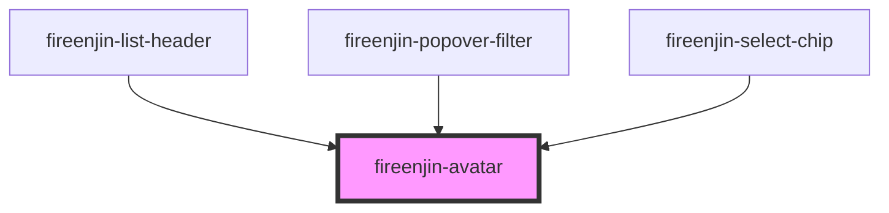

# fireenjin-avatar

<!-- Auto Generated Below -->

## Properties

| Property   | Attribute  | Description | Type     | Default     |
| ---------- | ---------- | ----------- | -------- | ----------- |
| `color`    | `color`    |             | `string` | `undefined` |
| `fallback` | `fallback` |             | `string` | `undefined` |
| `initials` | `initials` |             | `string` | `undefined` |
| `size`     | `size`     |             | `string` | `undefined` |
| `src`      | `src`      |             | `string` | `undefined` |

## Dependencies

### Used by

 - [fireenjin-list-header](../list-header)
 - [fireenjin-popover-filter](../popover-filter)
 - [fireenjin-select-chip](../select-chip)

### Graph

----------------------------------------------

*Built with [StencilJS](https://stenciljs.com/)*
