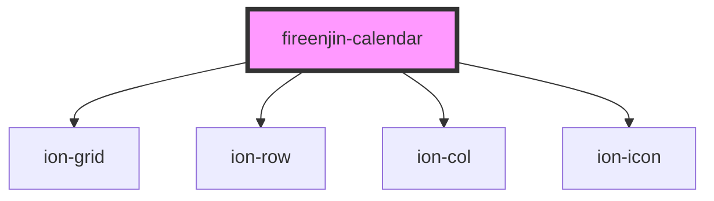

# fireenjin-calendar

<!-- Auto Generated Below -->

## Properties

| Property     | Attribute     | Description                                           | Type       | Default           |
| ------------ | ------------- | ----------------------------------------------------- | ---------- | ----------------- |
| `available`  | --            | A list of available dates to select                   | `string[]` | `undefined`       |
| `endDate`    | `end-date`    | The end date to select Y-m-d                          | `string`   | `undefined`       |
| `locales`    | `locales`     | Language locale to use for calendar                   | `string`   | `undefined`       |
| `max`        | `max`         | The maximum date that can be selected in Y-m-d format | `string`   | `undefined`       |
| `min`        | `min`         | The minimum date that can be selected in Y-m-d format | `string`   | `undefined`       |
| `month`      | `month`       | The month to set the calendar to                      | `number`   | `undefined`       |
| `range`      | `range`       | Should the calendar be used to select a date range    | `boolean`  | `undefined`       |
| `startDate`  | `start-date`  | The start date to select Y-m-d                        | `string`   | `undefined`       |
| `year`       | `year`        | The year to set the calendar to                       | `number`   | `undefined`       |
| `yearsTitle` | `years-title` | The title to use when showing the year selection view | `string`   | ``Select a Year`` |

## Events

| Event                       | Description                                | Type                                                                                                                                                            |
| --------------------------- | ------------------------------------------ | --------------------------------------------------------------------------------------------------------------------------------------------------------------- |
| `fireenjinCalendarNavigate` | Emitted when controls are used to navigate | `CustomEvent<{ event: any; year: number; month: number; currentView: "calendar" \| "months" \| "years"; back: boolean; startDate: string; endDate?: string; }>` |
| `fireenjinDateSelected`     | Emitted when a date is selected on the     | `CustomEvent<{ event: any; year: number; month: number; dateString: string; day: number; startDate: string; endDate?: string; }>`                               |

## Methods

### `setDate(dateString: string) => Promise<void>`

Set the current date of the calendar

#### Returns

Type: `Promise<void>`

### `switchView(event: any, view: "calendar" | "months" | "years") => Promise<"calendar" | "months" | "years">`

Switch the view of the calendar

#### Returns

Type: `Promise<"calendar" | "months" | "years">`

## Dependencies

### Depends on

- ion-grid
- ion-row
- ion-col
- ion-icon

### Graph

----------------------------------------------

*Built with [StencilJS](https://stenciljs.com/)*
