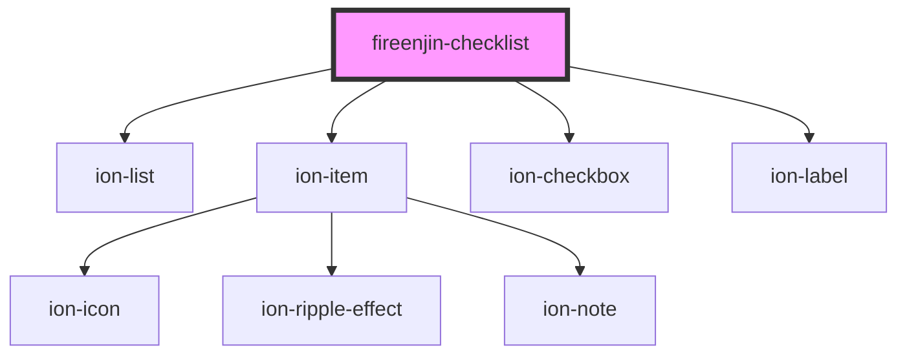

# fireenjin-checklist

<!-- Auto Generated Below -->

## Properties

| Property   | Attribute  | Description | Type            | Default     |
| ---------- | ---------- | ----------- | --------------- | ----------- |
| `disabled` | `disabled` |             | `boolean`       | `false`     |
| `name`     | `name`     |             | `string`        | `undefined` |
| `options`  | --         |             | `FieldOption[]` | `[]`        |
| `value`    | --         |             | `any[]`         | `[]`        |

## Events

| Event       | Description | Type               |
| ----------- | ----------- | ------------------ |
| `ionChange` |             | `CustomEvent<any>` |

## Dependencies

### Depends on

- ion-list
- ion-item
- ion-checkbox
- ion-label

### Graph

----------------------------------------------

*Built with [StencilJS](https://stenciljs.com/)*
