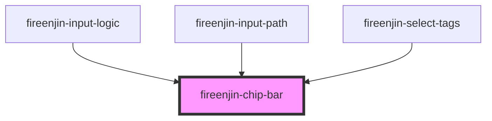

# fireenjin-chip-bar

<!-- Auto Generated Below -->

## Properties

| Property   | Attribute  | Description | Type      | Default |
| ---------- | ---------- | ----------- | --------- | ------- |
| `overflow` | `overflow` |             | `boolean` | `false` |

## Dependencies

### Used by

 - [fireenjin-input-logic](../input-logic)
 - [fireenjin-input-path](../input-path)
 - [fireenjin-select-tags](../select-tags)

### Graph

----------------------------------------------

*Built with [StencilJS](https://stenciljs.com/)*
