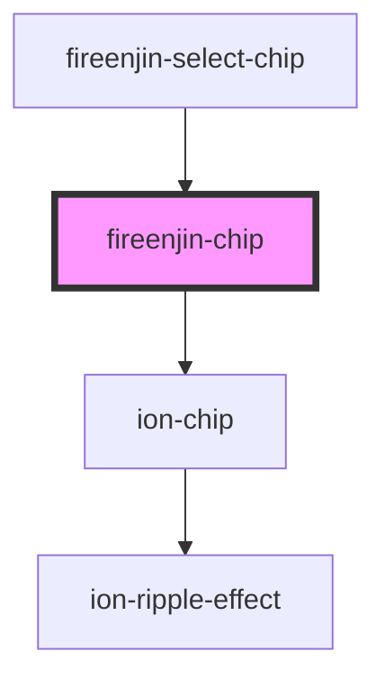

# fireenjin-chip

<!-- Auto Generated Below -->

## Properties

| Property   | Attribute  | Description | Type                                                                                                                                             | Default     |
| ---------- | ---------- | ----------- | ------------------------------------------------------------------------------------------------------------------------------------------------ | ----------- |
| `color`    | `color`    |             | `"danger" \| "dark" \| "light" \| "medium" \| "primary" \| "secondary" \| "success" \| "tertiary" \| "warning" \| string & Record<never, never>` | `undefined` |
| `disabled` | `disabled` |             | `boolean`                                                                                                                                        | `false`     |
| `href`     | `href`     |             | `string`                                                                                                                                         | `undefined` |
| `outline`  | `outline`  |             | `boolean`                                                                                                                                        | `false`     |

## Dependencies

### Used by

 - [fireenjin-select-chip](../select-chip)

### Depends on

- ion-chip

### Graph

----------------------------------------------

*Built with [StencilJS](https://stenciljs.com/)*
