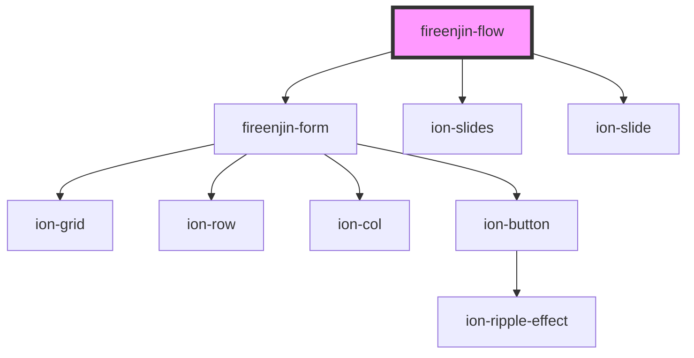

# fireenjin-flow

<!-- Auto Generated Below -->

## Properties

| Property        | Attribute        | Description                    | Type                | Default                |
| --------------- | ---------------- | ------------------------------ | ------------------- | ---------------------- |
| `endpoint`      | `endpoint`       |                                | `string`            | `undefined`            |
| `fields`        | --               |                                | `{ label: any; }[]` | `[]`                   |
| `pager`         | `pager`          |                                | `boolean`           | `false`                |
| `scrollbar`     | `scrollbar`      |                                | `boolean`           | `false`                |
| `showControls`  | `show-controls`  |                                | `boolean`           | `false`                |
| `slidesOptions` | `slides-options` | A list of options for SwiperJS | `any`               | `{ autoHeight: true }` |

## Dependencies

### Depends on

- [fireenjin-form](../form)
- ion-slides
- ion-slide

### Graph

----------------------------------------------

*Built with [StencilJS](https://stenciljs.com/)*
