# fireenjin-flow

<!-- Auto Generated Below -->

## Properties

| Property               | Attribute                | Description                                                            | Type                                                                                                                                                                                                                                                                 | Default                                                                                                         |
| ---------------------- | ------------------------ | ---------------------------------------------------------------------- | -------------------------------------------------------------------------------------------------------------------------------------------------------------------------------------------------------------------------------------------------------------------- | --------------------------------------------------------------------------------------------------------------- |
| `action`               | `action`                 | The action to use for the form                                         | `string`                                                                                                                                                                                                                                                             | `undefined`                                                                                                     |
| `allowNullRequired`    | `allow-null-required`    | Allow null to be accepted as required value                            | `boolean`                                                                                                                                                                                                                                                            | `false`                                                                                                         |
| `beforeSlide`          | --                       | A method that runs before slide                                        | `(data: any) => Promise<any>`                                                                                                                                                                                                                                        | `undefined`                                                                                                     |
| `beforeSubmit`         | --                       | A method that runs before form submission to allow editing of formData | `(data: any, options?: any) => Promise<any>`                                                                                                                                                                                                                         | `undefined`                                                                                                     |
| `cacheKey`             | `cache-key`              |                                                                        | `string`                                                                                                                                                                                                                                                             | `undefined`                                                                                                     |
| `confirmExit`          | `confirm-exit`           | Confirm leaving the page when the form is filled                       | `boolean`                                                                                                                                                                                                                                                            | `false`                                                                                                         |
| `disableEnterButton`   | `disable-enter-button`   | Should the enter button binding be disabled                            | `boolean`                                                                                                                                                                                                                                                            | `false`                                                                                                         |
| `disableLoader`        | `disable-loader`         | Should the form disable the loader on submit                           | `boolean`                                                                                                                                                                                                                                                            | `false`                                                                                                         |
| `disableRequiredCheck` | `disable-required-check` |                                                                        | `boolean`                                                                                                                                                                                                                                                            | `false`                                                                                                         |
| `documentId`           | `document-id`            | The id of the document being edited                                    | `string`                                                                                                                                                                                                                                                             | `undefined`                                                                                                     |
| `endpoint`             | `endpoint`               | The endpoint that form submission should link to                       | `string`                                                                                                                                                                                                                                                             | `undefined`                                                                                                     |
| `excludeData`          | --                       | The data to exclude from the form submit event                         | `string[]`                                                                                                                                                                                                                                                           | `[]`                                                                                                            |
| `fetch`                | `fetch`                  | Emit the fetch event emitted when component loads                      | `boolean \| string`                                                                                                                                                                                                                                                  | `undefined`                                                                                                     |
| `fetchDataMap`         | `fetch-data-map`         | The map to bind data from fetch response to form data                  | `any`                                                                                                                                                                                                                                                                | `undefined`                                                                                                     |
| `fetchKey`             | `fetch-key`              | The result key to use for formData                                     | `string`                                                                                                                                                                                                                                                             | `undefined`                                                                                                     |
| `fetchParams`          | `fetch-params`           | The fetch params                                                       | `any`                                                                                                                                                                                                                                                                | `undefined`                                                                                                     |
| `filterData`           | `filter-data`            | A comma separated list or array of items to filter out for submission  | `any`                                                                                                                                                                                                                                                                | `undefined`                                                                                                     |
| `formData`             | `form-data`              | The data from the form being filled out                                | `any`                                                                                                                                                                                                                                                                | `{}`                                                                                                            |
| `googleMapsKey`        | `google-maps-key`        |                                                                        | `string`                                                                                                                                                                                                                                                             | `undefined`                                                                                                     |
| `hasChanged`           | `has-changed`            | Has the form fields been changed                                       | `boolean`                                                                                                                                                                                                                                                            | `false`                                                                                                         |
| `hideControls`         | `hide-controls`          | Should the form controls be hidden?                                    | `boolean`                                                                                                                                                                                                                                                            | `false`                                                                                                         |
| `loading`              | `loading`                | Is the component currently loading                                     | `boolean`                                                                                                                                                                                                                                                            | `false`                                                                                                         |
| `method`               | `method`                 | The HTTP method to use when submitting the form                        | `string`                                                                                                                                                                                                                                                             | `undefined`                                                                                                     |
| `name`                 | `name`                   | The name of the form used for ID and name                              | `string`                                                                                                                                                                                                                                                             | `undefined`                                                                                                     |
| `nextButton`           | --                       | The next button for the slider                                         | `{ expand?: "block" \| "full"; label?: string; color?: Color; fill?: "default" \| "outline" \| "clear" \| "solid"; icon?: string; iconSlot?: string; onClick?: (event: any) => void; disabled?: boolean; shape?: "round"; size?: "small" \| "default" \| "large"; }` | `{     label: "Next",     color: "primary",     fill: "clear",     icon: "chevron-forward-circle-outline",   }` |
| `pager`                | `pager`                  |                                                                        | `boolean`                                                                                                                                                                                                                                                            | `false`                                                                                                         |
| `prevButton`           | --                       | The prev button for the slider                                         | `{ expand?: "block" \| "full"; label?: string; color?: Color; fill?: "default" \| "outline" \| "clear" \| "solid"; icon?: string; iconSlot?: string; onClick?: (event: any) => void; disabled?: boolean; shape?: "round"; size?: "small" \| "default" \| "large"; }` | `{     label: "Back",     color: "medium",     fill: "clear",     icon: "chevron-back-circle-outline",   }`     |
| `saveButton`           | --                       | The save button for the flow                                           | `{ expand?: "block" \| "full"; label?: string; color?: Color; fill?: "default" \| "outline" \| "clear" \| "solid"; icon?: string; iconSlot?: string; onClick?: (event: any) => void; disabled?: boolean; shape?: "round"; size?: "small" \| "default" \| "large"; }` | `{     label: "Save",     fill: "solid",     color: "primary",   }`                                             |
| `scrollbar`            | `scrollbar`              |                                                                        | `boolean`                                                                                                                                                                                                                                                            | `false`                                                                                                         |
| `slidesOptions`        | `slides-options`         | A list of options for SwiperJS                                         | `any`                                                                                                                                                                                                                                                                | `{ autoHeight: true, allowTouchMove: false }`                                                                   |
| `steps`                | --                       |                                                                        | `Step[]`                                                                                                                                                                                                                                                             | `[]`                                                                                                            |
| `stripeElements`       | `stripe-elements`        |                                                                        | `any`                                                                                                                                                                                                                                                                | `undefined`                                                                                                     |
| `stripeKey`            | `stripe-key`             |                                                                        | `string`                                                                                                                                                                                                                                                             | `undefined`                                                                                                     |

## Methods

### `checkFormValidity(reportValidity: boolean) => Promise<void>`

#### Returns

Type: `Promise<void>`

### `checkStepValidity() => Promise<boolean>`

#### Returns

Type: `Promise<boolean>`

### `getActiveIndex() => Promise<any>`

#### Returns

Type: `Promise<any>`

### `getSwiper() => Promise<any>`

#### Returns

Type: `Promise<any>`

### `isBeginning() => Promise<any>`

#### Returns

Type: `Promise<any>`

### `isEnd() => Promise<any>`

#### Returns

Type: `Promise<any>`

### `length() => Promise<any>`

#### Returns

Type: `Promise<any>`

### `lockSwipeToNext(lock: boolean) => Promise<any>`

#### Returns

Type: `Promise<any>`

### `lockSwipeToPrev(lock: boolean) => Promise<any>`

#### Returns

Type: `Promise<any>`

### `lockSwipes(lock: boolean) => Promise<any>`

#### Returns

Type: `Promise<any>`

### `reportFormValidity() => Promise<void>`

#### Returns

Type: `Promise<void>`

### `reset(event?: any) => Promise<void>`

#### Returns

Type: `Promise<void>`

### `setFormData(data: any) => Promise<void>`

#### Returns

Type: `Promise<void>`

### `slideNext(speed?: number, runCallbacks?: boolean) => Promise<any>`

#### Returns

Type: `Promise<any>`

### `slidePrev(speed?: number, runCallbacks?: boolean) => Promise<any>`

#### Returns

Type: `Promise<any>`

### `slideTo(index: number, speed?: number, runCallbacks?: boolean) => Promise<any>`

#### Returns

Type: `Promise<any>`

### `startAutoplay() => Promise<any>`

#### Returns

Type: `Promise<any>`

### `stopAutoplay() => Promise<any>`

#### Returns

Type: `Promise<any>`

### `submit(event?: any, options?: any) => Promise<void>`

#### Returns

Type: `Promise<void>`

### `update() => Promise<any>`

#### Returns

Type: `Promise<any>`

### `updateAutoHeight(speed?: number) => Promise<any>`

#### Returns

Type: `Promise<any>`

## Dependencies

### Depends on

- [fireenjin-input-file](../input-file)
- [fireenjin-input-photo](../input-photo)
- [fireenjin-input-address](../input-address)
- [fireenjin-select](../select)
- [fireenjin-radios](../radios)
- [fireenjin-input-search](../input-search)
- [fireenjin-checklist](../checklist)
- [fireenjin-input](../input)
- [fireenjin-form](../form)
- ion-slides
- ion-slide
- ion-button
- ion-icon
- ion-label

### Graph

```mermaid
graph TD;
  fireenjin-flow --> fireenjin-input-file
  fireenjin-flow --> fireenjin-input-photo
  fireenjin-flow --> fireenjin-input-address
  fireenjin-flow --> fireenjin-select
  fireenjin-flow --> fireenjin-radios
  fireenjin-flow --> fireenjin-input-search
  fireenjin-flow --> fireenjin-checklist
  fireenjin-flow --> fireenjin-input
  fireenjin-flow --> fireenjin-form
  fireenjin-flow --> ion-slides
  fireenjin-flow --> ion-slide
  fireenjin-flow --> ion-button
  fireenjin-flow --> ion-icon
  fireenjin-flow --> ion-label
  fireenjin-input-file --> ion-card
  fireenjin-input-file --> ion-item
  fireenjin-input-file --> ion-icon
  ion-card --> ion-ripple-effect
  ion-item --> ion-icon
  ion-item --> ion-ripple-effect
  ion-item --> ion-note
  fireenjin-input-photo --> ion-button
  fireenjin-input-photo --> ion-icon
  ion-button --> ion-ripple-effect
  fireenjin-input-address --> ion-item
  fireenjin-input-address --> ion-icon
  fireenjin-input-address --> ion-label
  fireenjin-input-address --> ion-input
  fireenjin-input-address --> ion-grid
  fireenjin-input-address --> ion-row
  fireenjin-input-address --> ion-col
  fireenjin-input-address --> fireenjin-input-state
  fireenjin-input-address --> ion-button
  fireenjin-input-address --> ion-buttons
  ion-input --> ion-icon
  fireenjin-input-state --> ion-select
  fireenjin-input-state --> ion-select-option
  ion-select --> ion-select-popover
  ion-select --> ion-popover
  ion-select --> ion-action-sheet
  ion-select --> ion-alert
  ion-select-popover --> ion-item
  ion-select-popover --> ion-checkbox
  ion-select-popover --> ion-label
  ion-select-popover --> ion-radio-group
  ion-select-popover --> ion-radio
  ion-select-popover --> ion-list
  ion-select-popover --> ion-list-header
  ion-popover --> ion-backdrop
  ion-action-sheet --> ion-backdrop
  ion-action-sheet --> ion-icon
  ion-action-sheet --> ion-ripple-effect
  ion-alert --> ion-ripple-effect
  ion-alert --> ion-backdrop
  fireenjin-select --> ion-label
  fireenjin-select --> ion-item
  fireenjin-select --> ion-popover
  fireenjin-select --> ion-content
  fireenjin-select --> ion-list
  fireenjin-select --> ion-item-divider
  fireenjin-select --> ion-select
  fireenjin-select --> ion-select-option
  fireenjin-select --> ion-icon
  fireenjin-radios --> ion-list
  fireenjin-radios --> ion-radio-group
  fireenjin-radios --> ion-list-header
  fireenjin-radios --> ion-item
  fireenjin-radios --> ion-label
  fireenjin-radios --> ion-radio
  fireenjin-input-search --> ion-item
  fireenjin-input-search --> ion-icon
  fireenjin-input-search --> ion-label
  fireenjin-input-search --> ion-input
  fireenjin-checklist --> ion-list
  fireenjin-checklist --> ion-item
  fireenjin-checklist --> ion-checkbox
  fireenjin-checklist --> ion-label
  fireenjin-input --> ion-input
  fireenjin-input --> ion-item
  fireenjin-input --> ion-icon
  fireenjin-input --> ion-label
  fireenjin-form --> ion-grid
  fireenjin-form --> ion-row
  fireenjin-form --> ion-col
  fireenjin-form --> ion-button
  style fireenjin-flow fill:#f9f,stroke:#333,stroke-width:4px
```

----------------------------------------------

*Built with [StencilJS](https://stenciljs.com/)*
