# fireenjin-flow

<!-- Auto Generated Below -->

## Properties

| Property             | Attribute              | Description                                                            | Type                                                               | Default                |
| -------------------- | ---------------------- | ---------------------------------------------------------------------- | ------------------------------------------------------------------ | ---------------------- |
| `action`             | `action`               | The action to use for the form                                         | `string`                                                           | `undefined`            |
| `beforeSubmit`       | --                     | A method that runs before form submission to allow editing of formData | `(data: any, options?: any) => Promise<any>`                       | `undefined`            |
| `confirmExit`        | `confirm-exit`         | Confirm leaving the page when the form is filled                       | `boolean`                                                          | `false`                |
| `disableEnterButton` | `disable-enter-button` | Should the enter button binding be disabled                            | `boolean`                                                          | `false`                |
| `disableLoader`      | `disable-loader`       | Should the form disable the loader on submit                           | `boolean`                                                          | `false`                |
| `disableReset`       | `disable-reset`        | Should the form disable reset                                          | `boolean`                                                          | `false`                |
| `documentId`         | `document-id`          | The id of the document being edited                                    | `string`                                                           | `undefined`            |
| `endpoint`           | `endpoint`             | The endpoint that form submission should link to                       | `string`                                                           | `undefined`            |
| `excludeData`        | --                     | The data to exclude from the form submit event                         | `string[]`                                                         | `[]`                   |
| `fetch`              | `fetch`                | Emit the fetch event emitted when component loads                      | `boolean \| string`                                                | `undefined`            |
| `fetchDataMap`       | `fetch-data-map`       | The map to bind data from fetch response to form data                  | `any`                                                              | `undefined`            |
| `fetchParams`        | `fetch-params`         | The fetch params                                                       | `any`                                                              | `undefined`            |
| `formData`           | `form-data`            | The data from the form being filled out                                | `any`                                                              | `{}`                   |
| `googleMapsKey`      | `google-maps-key`      |                                                                        | `string`                                                           | `undefined`            |
| `hasChanged`         | `has-changed`          | Has the form fields been changed                                       | `boolean`                                                          | `false`                |
| `hideControls`       | `hide-controls`        | Should the form controls be hidden?                                    | `boolean`                                                          | `false`                |
| `loading`            | `loading`              | Is the component currently loading                                     | `boolean`                                                          | `false`                |
| `method`             | `method`               | The HTTP method to use when submitting the form                        | `string`                                                           | `"post"`               |
| `name`               | `name`                 | The name of the form used for ID and name                              | `string`                                                           | `undefined`            |
| `pager`              | `pager`                |                                                                        | `boolean`                                                          | `false`                |
| `resetButton`        | `reset-button`         | What the reset button says                                             | `string`                                                           | `"Cancel"`             |
| `resetButtonColor`   | `reset-button-color`   | What color the reset button is                                         | `string`                                                           | `"dark"`               |
| `resetButtonFill`    | `reset-button-fill`    | What fill option to use for the reset button                           | `"clear" \| "default" \| "outline" \| "solid"`                     | `"clear"`              |
| `scrollbar`          | `scrollbar`            |                                                                        | `boolean`                                                          | `false`                |
| `showControls`       | `show-controls`        |                                                                        | `boolean`                                                          | `false`                |
| `slidesOptions`      | `slides-options`       | A list of options for SwiperJS                                         | `any`                                                              | `{ autoHeight: true }` |
| `steps`              | --                     |                                                                        | `{ beforeHTML?: string; fields?: Field[]; afterHTML?: string; }[]` | `[]`                   |
| `stripeElements`     | `stripe-elements`      |                                                                        | `any`                                                              | `undefined`            |
| `stripeKey`          | `stripe-key`           |                                                                        | `string`                                                           | `undefined`            |
| `submitButton`       | `submit-button`        | What the save button says                                              | `string`                                                           | `"Save"`               |
| `submitButtonColor`  | `submit-button-color`  | What color the submit button is                                        | `string`                                                           | `"primary"`            |
| `submitButtonFill`   | `submit-button-fill`   | What fill option to use for the submit button                          | `"clear" \| "default" \| "outline" \| "solid"`                     | `"solid"`              |

## Methods

### `getActiveIndex() => Promise<number>`

#### Returns

Type: `Promise<number>`

### `getSwiper() => Promise<any>`

#### Returns

Type: `Promise<any>`

### `isBeginning() => Promise<boolean>`

#### Returns

Type: `Promise<boolean>`

### `isEnd() => Promise<boolean>`

#### Returns

Type: `Promise<boolean>`

### `length() => Promise<number>`

#### Returns

Type: `Promise<number>`

### `lockSwipeToNext(lock: boolean) => Promise<void>`

#### Returns

Type: `Promise<void>`

### `lockSwipeToPrev(lock: boolean) => Promise<void>`

#### Returns

Type: `Promise<void>`

### `lockSwipes(lock: boolean) => Promise<void>`

#### Returns

Type: `Promise<void>`

### `slideNext(speed?: number, runCallbacks?: boolean) => Promise<void>`

#### Returns

Type: `Promise<void>`

### `slidePrev(speed?: number, runCallbacks?: boolean) => Promise<void>`

#### Returns

Type: `Promise<void>`

### `slideTo(index: number, speed?: number, runCallbacks?: boolean) => Promise<void>`

#### Returns

Type: `Promise<void>`

### `startAutoplay() => Promise<void>`

#### Returns

Type: `Promise<void>`

### `stopAutoplay() => Promise<void>`

#### Returns

Type: `Promise<void>`

### `update() => Promise<void>`

#### Returns

Type: `Promise<void>`

### `updateAutoHeight(speed?: number) => Promise<void>`

#### Returns

Type: `Promise<void>`

## Dependencies

### Depends on

- [fireenjin-input-file](../input-file)
- [fireenjin-input-photo](../input-photo)
- [fireenjin-input-address](../input-address)
- [fireenjin-select](../select)
- [fireenjin-input-search](../input-search)
- [fireenjin-input](../input)
- [fireenjin-form](../form)
- ion-slides
- ion-slide

### Graph

```mermaid
graph TD;
  fireenjin-flow --> fireenjin-input-file
  fireenjin-flow --> fireenjin-input-photo
  fireenjin-flow --> fireenjin-input-address
  fireenjin-flow --> fireenjin-select
  fireenjin-flow --> fireenjin-input-search
  fireenjin-flow --> fireenjin-input
  fireenjin-flow --> fireenjin-form
  fireenjin-flow --> ion-slides
  fireenjin-flow --> ion-slide
  fireenjin-input-file --> ion-card
  fireenjin-input-file --> ion-item
  fireenjin-input-file --> ion-icon
  ion-card --> ion-ripple-effect
  ion-item --> ion-icon
  ion-item --> ion-ripple-effect
  ion-item --> ion-note
  fireenjin-input-photo --> ion-button
  fireenjin-input-photo --> ion-icon
  ion-button --> ion-ripple-effect
  fireenjin-input-address --> ion-item
  fireenjin-input-address --> ion-label
  fireenjin-input-address --> ion-input
  fireenjin-input-address --> ion-grid
  fireenjin-input-address --> ion-row
  fireenjin-input-address --> ion-col
  fireenjin-input-address --> fireenjin-input-state
  fireenjin-input-address --> ion-button
  fireenjin-input-state --> ion-select
  fireenjin-input-state --> ion-select-option
  ion-select --> ion-select-popover
  ion-select --> ion-popover
  ion-select --> ion-action-sheet
  ion-select --> ion-alert
  ion-select-popover --> ion-item
  ion-select-popover --> ion-checkbox
  ion-select-popover --> ion-label
  ion-select-popover --> ion-radio-group
  ion-select-popover --> ion-radio
  ion-select-popover --> ion-list
  ion-select-popover --> ion-list-header
  ion-popover --> ion-backdrop
  ion-action-sheet --> ion-backdrop
  ion-action-sheet --> ion-icon
  ion-action-sheet --> ion-ripple-effect
  ion-alert --> ion-ripple-effect
  ion-alert --> ion-backdrop
  fireenjin-select --> ion-item
  fireenjin-select --> ion-icon
  fireenjin-select --> ion-label
  fireenjin-select --> ion-select
  fireenjin-select --> ion-select-option
  fireenjin-input-search --> ion-item
  fireenjin-input-search --> ion-icon
  fireenjin-input-search --> ion-label
  fireenjin-input-search --> ion-input
  fireenjin-input --> ion-input
  fireenjin-input --> ion-item
  fireenjin-input --> ion-icon
  fireenjin-input --> ion-label
  fireenjin-form --> ion-grid
  fireenjin-form --> ion-row
  fireenjin-form --> ion-col
  fireenjin-form --> ion-button
  style fireenjin-flow fill:#f9f,stroke:#333,stroke-width:4px
```

----------------------------------------------

*Built with [StencilJS](https://stenciljs.com/)*
