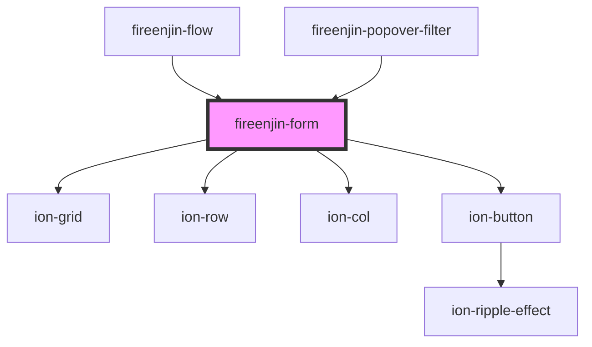

# fireenjin-form

<!-- Auto Generated Below -->

## Properties

| Property             | Attribute              | Description                                                            | Type                                           | Default     |
| -------------------- | ---------------------- | ---------------------------------------------------------------------- | ---------------------------------------------- | ----------- |
| `action`             | `action`               | The action to use for the form                                         | `string`                                       | `undefined` |
| `beforeSubmit`       | --                     | A method that runs before form submission to allow editing of formData | `(data: any, options?: any) => Promise<any>`   | `undefined` |
| `cacheKey`           | `cache-key`            | The localforage key name to store as                                   | `string`                                       | `undefined` |
| `collection`         | `collection`           | The collection to use for cache and firestore                          | `string`                                       | `undefined` |
| `confirmExit`        | `confirm-exit`         | Confirm leaving the page when the form is filled                       | `boolean`                                      | `false`     |
| `disableEnterButton` | `disable-enter-button` | Should the enter button binding be disabled                            | `boolean`                                      | `false`     |
| `disableLoader`      | `disable-loader`       | Should the form disable the loader on submit                           | `boolean`                                      | `false`     |
| `disableReset`       | `disable-reset`        | Should the form disable reset                                          | `boolean`                                      | `false`     |
| `documentId`         | `document-id`          | The id of the document being edited                                    | `string`                                       | `undefined` |
| `endpoint`           | `endpoint`             | The endpoint that form submission should link to                       | `string`                                       | `undefined` |
| `fetch`              | `fetch`                | Emit the fetch event emitted when component loads                      | `boolean \| string`                            | `undefined` |
| `fetchDataMap`       | `fetch-data-map`       | The map to bind data from fetch response to form data                  | `any`                                          | `undefined` |
| `fetchKey`           | `fetch-key`            | The result key to use for formData                                     | `string`                                       | `undefined` |
| `fetchParams`        | `fetch-params`         | The fetch params                                                       | `any`                                          | `undefined` |
| `filterData`         | `filter-data`          | A comma separated list or array of items to filter out for submission  | `any`                                          | `undefined` |
| `formData`           | `form-data`            | The data from the form being filled out                                | `any`                                          | `{}`        |
| `hasChanged`         | `has-changed`          | Has the form fields been changed                                       | `boolean`                                      | `false`     |
| `hideControls`       | `hide-controls`        | Should the form controls be hidden?                                    | `boolean`                                      | `false`     |
| `loading`            | `loading`              | Is the component currently loading                                     | `boolean`                                      | `false`     |
| `method`             | `method`               | The HTTP method to use when submitting the form                        | `string`                                       | `undefined` |
| `name`               | `name`                 | The name of the form used for ID and name                              | `string`                                       | `undefined` |
| `resetButton`        | `reset-button`         | What the reset button says                                             | `string`                                       | `"Cancel"`  |
| `resetButtonColor`   | `reset-button-color`   | What color the reset button is                                         | `string`                                       | `"dark"`    |
| `resetButtonFill`    | `reset-button-fill`    | What fill option to use for the reset button                           | `"clear" \| "default" \| "outline" \| "solid"` | `"clear"`   |
| `resetButtonShape`   | `reset-button-shape`   | What shape is the reset button                                         | `"round"`                                      | `undefined` |
| `resetButtonSize`    | `reset-button-size`    | What size is the reset button                                          | `"default" \| "large" \| "small"`              | `undefined` |
| `store`              | --                     | The Stencil Store to bind to                                           | `{ state: any; key: string; }`                 | `undefined` |
| `submitButton`       | `submit-button`        | What the save button says                                              | `string`                                       | `"Save"`    |
| `submitButtonColor`  | `submit-button-color`  | What color the submit button is                                        | `string`                                       | `"primary"` |
| `submitButtonFill`   | `submit-button-fill`   | What fill option to use for the submit button                          | `"clear" \| "default" \| "outline" \| "solid"` | `"solid"`   |
| `submitButtonShape`  | `submit-button-shape`  | What shape is the submit button                                        | `"round"`                                      | `undefined` |
| `submitButtonSize`   | `submit-button-size`   | What size is the reset button                                          | `"default" \| "large" \| "small"`              | `undefined` |

## Events

| Event                 | Description                            | Type                                                                                  |
| --------------------- | -------------------------------------- | ------------------------------------------------------------------------------------- |
| `fireenjinFetch`      | Emitted on load with endpoint          | `CustomEvent<FireEnjinFetchEvent>`                                                    |
| `fireenjinReset`      | Emitted when the user resets the form  | `CustomEvent<{ event: any; id: string; endpoint: string; data: any; name: string; }>` |
| `fireenjinSubmit`     | Emitted when the user submits the form | `CustomEvent<FireEnjinSubmitEvent>`                                                   |
| `fireenjinValidation` | Emitted when a filed checks validation | `CustomEvent<{ event: any; isValid: boolean; name: string; }>`                        |

## Methods

### `checkFormValidity(reportValidity?: boolean) => Promise<boolean>`

#### Returns

Type: `Promise<boolean>`

### `clearCache() => Promise<void>`

Clear the cache for the saved form

#### Returns

Type: `Promise<void>`

### `fetchData() => Promise<void>`

#### Returns

Type: `Promise<void>`

### `reportFormValidity() => Promise<void>`

#### Returns

Type: `Promise<void>`

### `reset(event?: any) => Promise<boolean>`

Emit fireenjinReset event with form data

#### Returns

Type: `Promise<boolean>`

### `restoreCache() => Promise<void>`

Restore the formData from the local cache

#### Returns

Type: `Promise<void>`

### `saveCache() => Promise<any>`

Save the formData to the local cache

#### Returns

Type: `Promise<any>`

### `setFormData(data: any) => Promise<void>`

#### Returns

Type: `Promise<void>`

### `submit(event?: any, options?: { manual: boolean; }) => Promise<void>`

Emit fireenjinSubmit event with form data

#### Returns

Type: `Promise<void>`

## Dependencies

### Used by

 - [fireenjin-flow](../flow)
 - [fireenjin-popover-filter](../popover-filter)

### Depends on

- ion-grid
- ion-row
- ion-col
- ion-button

### Graph

----------------------------------------------

*Built with [StencilJS](https://stenciljs.com/)*
