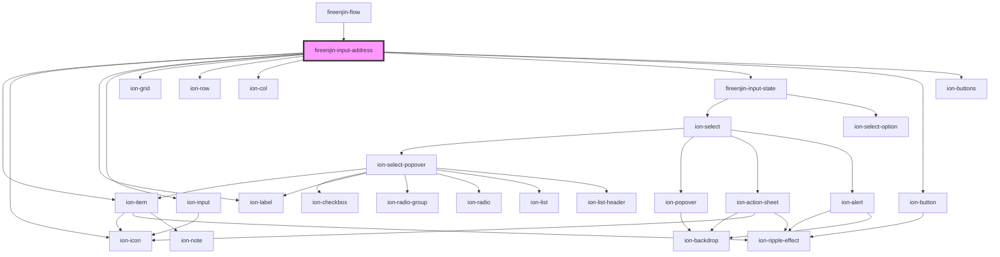

# fireenjin-input-address

<!-- Auto Generated Below -->

## Properties

| Property        | Attribute         | Description                              | Type                                 | Default     |
| --------------- | ----------------- | ---------------------------------------- | ------------------------------------ | ----------- |
| `googleMapsKey` | `google-maps-key` | The Google Maps API Key                  | `string`                             | `undefined` |
| `iconLeft`      | `icon-left`       |                                          | `string`                             | `undefined` |
| `iconRight`     | `icon-right`      |                                          | `string`                             | `undefined` |
| `label`         | `label`           | The label of the input field             | `string`                             | `undefined` |
| `labelPosition` | `label-position`  |                                          | `"fixed" \| "floating" \| "stacked"` | `undefined` |
| `lines`         | `lines`           |                                          | `"full" \| "inset" \| "none"`        | `undefined` |
| `name`          | `name`            | The name attribute of the input          | `string`                             | `undefined` |
| `placeholder`   | `placeholder`     | The placeholder text for the input field | `string`                             | `undefined` |
| `required`      | `required`        | Whether the address input is required    | `boolean`                            | `false`     |
| `value`         | `value`           | The value of the input field             | `any`                                | `{}`        |

## Events

| Event                       | Description | Type               |
| --------------------------- | ----------- | ------------------ |
| `fireenjinAddressMode`      |             | `CustomEvent<any>` |
| `fireenjinUpdateAutoHeight` |             | `CustomEvent<any>` |
| `ionInput`                  |             | `CustomEvent<any>` |

## Dependencies

### Used by

 - [fireenjin-flow](../flow)

### Depends on

- ion-item
- ion-icon
- ion-label
- ion-input
- ion-grid
- ion-row
- ion-col
- [fireenjin-input-state](../input-state)
- ion-button
- ion-buttons

### Graph

----------------------------------------------

*Built with [StencilJS](https://stenciljs.com/)*
