# fireenjin-logic

<!-- Auto Generated Below -->

## Properties

| Property           | Attribute           | Description | Type                                   | Default                                                                                                                                                                                                                                                                                                                                                                                                                                                                                                                                                                                                                                                                                                                                                                                                                                                                                                                                                                                                                                                                                                                                                                                                                                                                                              |
| ------------------ | ------------------- | ----------- | -------------------------------------- | ---------------------------------------------------------------------------------------------------------------------------------------------------------------------------------------------------------------------------------------------------------------------------------------------------------------------------------------------------------------------------------------------------------------------------------------------------------------------------------------------------------------------------------------------------------------------------------------------------------------------------------------------------------------------------------------------------------------------------------------------------------------------------------------------------------------------------------------------------------------------------------------------------------------------------------------------------------------------------------------------------------------------------------------------------------------------------------------------------------------------------------------------------------------------------------------------------------------------------------------------------------------------------------------------------- |
| `allowAdding`      | `allow-adding`      |             | `boolean`                              | `false`                                                                                                                                                                                                                                                                                                                                                                                                                                                                                                                                                                                                                                                                                                                                                                                                                                                                                                                                                                                                                                                                                                                                                                                                                                                                                              |
| `joinBy`           | `join-by`           |             | `"and" \| "or"`                        | `"and"`                                                                                                                                                                                                                                                                                                                                                                                                                                                                                                                                                                                                                                                                                                                                                                                                                                                                                                                                                                                                                                                                                                                                                                                                                                                                                              |
| `label`            | `label`             |             | `string`                               | `"Statements"`                                                                                                                                                                                                                                                                                                                                                                                                                                                                                                                                                                                                                                                                                                                                                                                                                                                                                                                                                                                                                                                                                                                                                                                                                                                                                       |
| `name`             | `name`              |             | `string`                               | `"logic"`                                                                                                                                                                                                                                                                                                                                                                                                                                                                                                                                                                                                                                                                                                                                                                                                                                                                                                                                                                                                                                                                                                                                                                                                                                                                                            |
| `operations`       | --                  |             | `{ [key: string]: any; }`              | `{     var: { var: "" },     missing: { missing: ["", ""] },     missing_some: { missing_some: ["", [""]] },     if: { if: ["", true, false] },     "==": { "==": ["", ""] },     "===": { "===": ["", ""] },     "!=": { "!=": ["", ""] },     "!==": { "!==": ["", ""] },     "!": { "!": ["", ""] },     "!!": { "!!": ["", ""] },     or: { or: [] },     and: { and: [] },     ">": { ">": [1, 0] },     ">=": { ">=": [1, 0] },     "<": { "<": [0, 1] },     "<=": { "<=": [0, 1] },     min: { min: [0, 1] },     max: { max: [0, 1] },     "+": { "+": [0, 1] },     "-": { "-": [0, 1] },     "*": { "*": [0, 1] },     "/": { "/": [0, 1] },     "%": { "%": [0, 1] },     map: { map: [{ var: "" }, {}] },     filter: { filter: [{ var: "" }, {}] },     reduce: {       reduce: [         { var: "" },         { "+": [{ var: "current" }, { var: "accumulator" }] },         0,       ],     },     all: { all: [[1, 2, 3], { ">": [{ var: "" }, 0] }] },     some: { some: [[-1, 0, 1], { ">": [{ var: "" }, 0] }] },     none: { none: [[-3, -2, -1], { ">": [{ var: "" }, 0] }] },     merge: {       merge: [         [1, 2],         [3, 4],       ],     },     in: { in: ["", [""]] },     cat: { cat: ["", ""] },     substr: { substr: ["", 0] },     log: { log: "" },   }` |
| `placeholder`      | `placeholder`       |             | `string`                               | `"No statements added yet"`                                                                                                                                                                                                                                                                                                                                                                                                                                                                                                                                                                                                                                                                                                                                                                                                                                                                                                                                                                                                                                                                                                                                                                                                                                                                          |
| `selectedOperator` | `selected-operator` |             | `string`                               | `"=="`                                                                                                                                                                                                                                                                                                                                                                                                                                                                                                                                                                                                                                                                                                                                                                                                                                                                                                                                                                                                                                                                                                                                                                                                                                                                                               |
| `selectedType`     | `selected-type`     |             | `"number" \| "string" \| "variable"`   | `undefined`                                                                                                                                                                                                                                                                                                                                                                                                                                                                                                                                                                                                                                                                                                                                                                                                                                                                                                                                                                                                                                                                                                                                                                                                                                                                                          |
| `showCode`         | `show-code`         |             | `boolean`                              | `false`                                                                                                                                                                                                                                                                                                                                                                                                                                                                                                                                                                                                                                                                                                                                                                                                                                                                                                                                                                                                                                                                                                                                                                                                                                                                                              |
| `value`            | `value`             |             | `any`                                  | `this.joinBy === "and" ? this.operations.and : this.operations.or`                                                                                                                                                                                                                                                                                                                                                                                                                                                                                                                                                                                                                                                                                                                                                                                                                                                                                                                                                                                                                                                                                                                                                                                                                                   |
| `variables`        | --                  |             | `{ [key: string]: Partial<Control>; }` | `{}`                                                                                                                                                                                                                                                                                                                                                                                                                                                                                                                                                                                                                                                                                                                                                                                                                                                                                                                                                                                                                                                                                                                                                                                                                                                                                                 |

## Methods

### `addStatment(statement: any) => Promise<void>`

#### Returns

Type: `Promise<void>`

### `removeStatement(index: number) => Promise<void>`

#### Returns

Type: `Promise<void>`

### `toggleManualEdit() => Promise<void>`

#### Returns

Type: `Promise<void>`

## Dependencies

### Depends on

- ion-item-divider
- ion-buttons
- ion-button
- ion-icon
- ion-label
- ion-select
- ion-select-option
- ion-item
- ion-chip
- ion-grid
- ion-row
- ion-col
- ion-popover
- ion-content
- ion-list
- ion-input

### Graph

```mermaid
graph TD;
  fireenjin-input-logic --> ion-item-divider
  fireenjin-input-logic --> ion-buttons
  fireenjin-input-logic --> ion-button
  fireenjin-input-logic --> ion-icon
  fireenjin-input-logic --> ion-label
  fireenjin-input-logic --> ion-select
  fireenjin-input-logic --> ion-select-option
  fireenjin-input-logic --> ion-item
  fireenjin-input-logic --> ion-chip
  fireenjin-input-logic --> ion-grid
  fireenjin-input-logic --> ion-row
  fireenjin-input-logic --> ion-col
  fireenjin-input-logic --> ion-popover
  fireenjin-input-logic --> ion-content
  fireenjin-input-logic --> ion-list
  fireenjin-input-logic --> ion-input
  ion-button --> ion-ripple-effect
  ion-select --> ion-select-popover
  ion-select --> ion-popover
  ion-select --> ion-action-sheet
  ion-select --> ion-alert
  ion-select-popover --> ion-item
  ion-select-popover --> ion-checkbox
  ion-select-popover --> ion-label
  ion-select-popover --> ion-radio-group
  ion-select-popover --> ion-radio
  ion-select-popover --> ion-list
  ion-select-popover --> ion-list-header
  ion-item --> ion-icon
  ion-item --> ion-ripple-effect
  ion-item --> ion-note
  ion-popover --> ion-backdrop
  ion-action-sheet --> ion-backdrop
  ion-action-sheet --> ion-icon
  ion-action-sheet --> ion-ripple-effect
  ion-alert --> ion-ripple-effect
  ion-alert --> ion-backdrop
  ion-chip --> ion-ripple-effect
  ion-input --> ion-icon
  style fireenjin-input-logic fill:#f9f,stroke:#333,stroke-width:4px
```

----------------------------------------------

*Built with [StencilJS](https://stenciljs.com/)*
