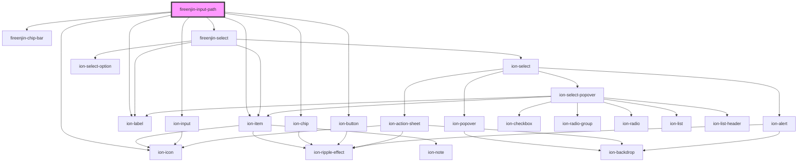

# fireenjin-input-path

<!-- Auto Generated Below -->

## Properties

| Property        | Attribute        | Description | Type                                                                                                                                             | Default          |
| --------------- | ---------------- | ----------- | ------------------------------------------------------------------------------------------------------------------------------------------------ | ---------------- |
| `addColor`      | `add-color`      |             | `"danger" \| "dark" \| "light" \| "medium" \| "primary" \| "secondary" \| "success" \| "tertiary" \| "warning" \| string & Record<never, never>` | `"primary"`      |
| `addIcon`       | `add-icon`       |             | `string`                                                                                                                                         | `"add-circle"`   |
| `deleteColor`   | `delete-color`   |             | `"danger" \| "dark" \| "light" \| "medium" \| "primary" \| "secondary" \| "success" \| "tertiary" \| "warning" \| string & Record<never, never>` | `"danger"`       |
| `deleteIcon`    | `delete-icon`    |             | `string`                                                                                                                                         | `"close-circle"` |
| `disabled`      | `disabled`       |             | `boolean`                                                                                                                                        | `false`          |
| `label`         | `label`          |             | `string`                                                                                                                                         | `undefined`      |
| `labelPosition` | `label-position` |             | `"fixed" \| "floating" \| "stacked"`                                                                                                             | `undefined`      |
| `name`          | `name`           |             | `string`                                                                                                                                         | `"path"`         |
| `partOptions`   | --               |             | `any[]`                                                                                                                                          | `undefined`      |
| `typeOptions`   | --               |             | `any[]`                                                                                                                                          | `undefined`      |
| `value`         | `value`          |             | `any`                                                                                                                                            | `undefined`      |

## Methods

### `addPathChunk() => Promise<any>`

#### Returns

Type: `Promise<any>`

### `deletePathChunk(index: number) => Promise<any>`

#### Returns

Type: `Promise<any>`

### `toggleManualEdit() => Promise<void>`

#### Returns

Type: `Promise<void>`

## Dependencies

### Depends on

- ion-item
- ion-label
- ion-input
- [fireenjin-chip-bar](../chip-bar)
- ion-chip
- ion-button
- ion-icon
- [fireenjin-select](../select)

### Graph

----------------------------------------------

*Built with [StencilJS](https://stenciljs.com/)*
