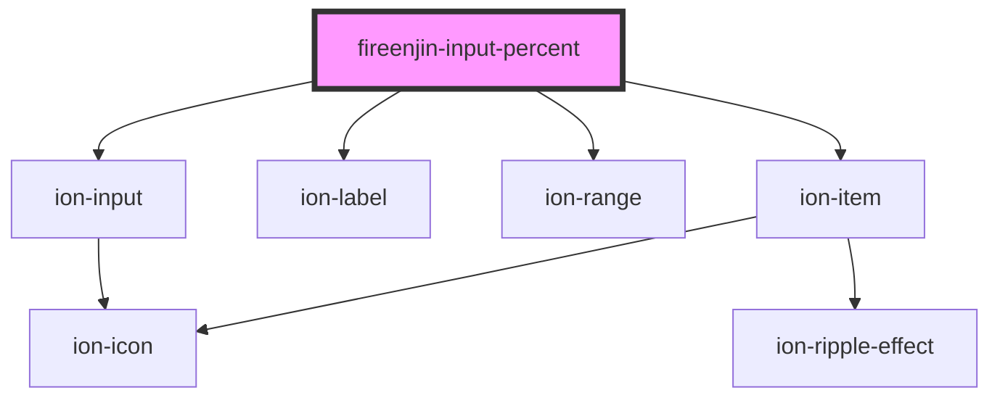

# fireenjin-input-percent

<!-- Auto Generated Below -->

## Properties

| Property        | Attribute        | Description | Type                                                                                                                                             | Default                                            |
| --------------- | ---------------- | ----------- | ------------------------------------------------------------------------------------------------------------------------------------------------ | -------------------------------------------------- |
| `color`         | `color`          |             | `"danger" \| "dark" \| "light" \| "medium" \| "primary" \| "secondary" \| "success" \| "tertiary" \| "warning" \| string & Record<never, never>` | `undefined`                                        |
| `debounce`      | `debounce`       |             | `number`                                                                                                                                         | `300`                                              |
| `disabled`      | `disabled`       |             | `boolean`                                                                                                                                        | `false`                                            |
| `label`         | `label`          |             | `string`                                                                                                                                         | `"Percent"`                                        |
| `labelPosition` | `label-position` |             | `"fixed" \| "floating" \| "stacked"`                                                                                                             | `"stacked"`                                        |
| `lines`         | `lines`          |             | `"full" \| "inset" \| "none"`                                                                                                                    | `"none"`                                           |
| `max`           | `max`            |             | `number`                                                                                                                                         | `1`                                                |
| `min`           | `min`            |             | `number`                                                                                                                                         | `0`                                                |
| `name`          | `name`           |             | `string`                                                                                                                                         | `"percent"`                                        |
| `pin`           | `pin`            |             | `boolean`                                                                                                                                        | `true`                                             |
| `pinFormatter`  | --               |             | `(value: number) => string`                                                                                                                      | `(value: number) => `${Math.round(value * 100)}%`` |
| `step`          | `step`           |             | `number`                                                                                                                                         | `0.01`                                             |
| `value`         | `value`          |             | `number \| { lower: number; upper: number; }`                                                                                                    | `0`                                                |

## Dependencies

### Depends on

- ion-item
- ion-label
- ion-range
- ion-input

### Graph

----------------------------------------------

*Built with [StencilJS](https://stenciljs.com/)*
