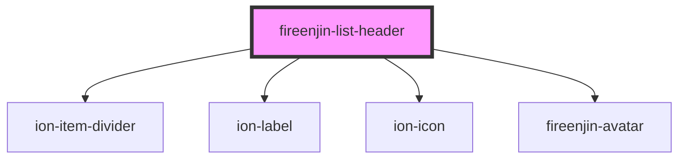

# fireenjin-list-header

<!-- Auto Generated Below -->

## Properties

| Property    | Attribute    | Description | Type     | Default     |
| ----------- | ------------ | ----------- | -------- | ----------- |
| `icon`      | `icon`       |             | `string` | `undefined` |
| `image`     | `image`      |             | `string` | `undefined` |
| `imageSize` | `image-size` |             | `string` | `undefined` |
| `label`     | `label`      |             | `string` | `undefined` |

## Dependencies

### Depends on

- ion-item-divider
- ion-label
- ion-icon
- [fireenjin-avatar](../avatar)

### Graph

----------------------------------------------

*Built with [StencilJS](https://stenciljs.com/)*
