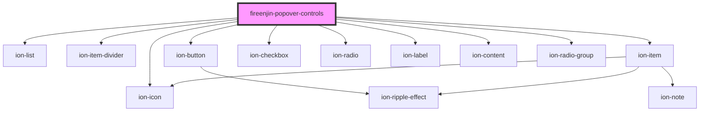

# floodteam-popover-controls

<!-- Auto Generated Below -->

## Properties

| Property    | Attribute    | Description                                                     | Type                          | Default     |
| ----------- | ------------ | --------------------------------------------------------------- | ----------------------------- | ----------- |
| `checkable` | `checkable`  | Can you check the controls                                      | `boolean`                     | `false`     |
| `controls`  | --           | The list of buttons to show when the material button is clicked | `Control[]`                   | `[]`        |
| `el`        | `el`         |                                                                 | `any`                         | `undefined` |
| `icon`      | `icon`       | The icon to display in the header label                         | `string`                      | `undefined` |
| `label`     | `label`      | The label to display at the top of the popover                  | `string`                      | `undefined` |
| `multiple`  | `multiple`   | Can you select multiple                                         | `boolean`                     | `false`     |
| `name`      | `name`       | The name of the input                                           | `string`                      | `undefined` |
| `showClear` | `show-clear` | Should we show the clear button                                 | `boolean`                     | `false`     |
| `type`      | `type`       | The type of event to fire when a options are selected           | `"move" \| "select" \| "set"` | `"set"`     |
| `value`     | `value`      | The value of the input                                          | `any`                         | `undefined` |

## Events

| Event              | Description | Type               |
| ------------------ | ----------- | ------------------ |
| `fireenjinTrigger` |             | `CustomEvent<any>` |

## Dependencies

### Depends on

- ion-list
- ion-item-divider
- ion-icon
- ion-button
- ion-item
- ion-checkbox
- ion-radio
- ion-label
- ion-content
- ion-radio-group

### Graph

----------------------------------------------

*Built with [StencilJS](https://stenciljs.com/)*
