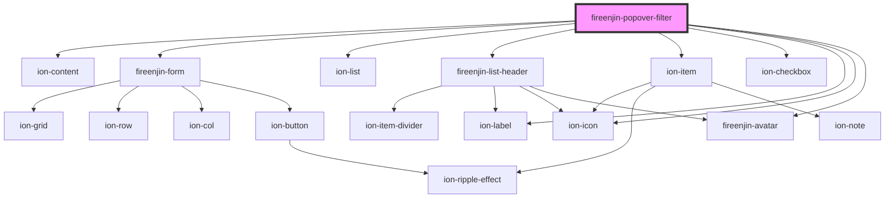

# fireenjin-popover-filter

<!-- Auto Generated Below -->

## Properties

| Property       | Attribute       | Description | Type                                                                                                                                                                                                                                                                                                                                                                                                                  | Default     |
| -------------- | --------------- | ----------- | --------------------------------------------------------------------------------------------------------------------------------------------------------------------------------------------------------------------------------------------------------------------------------------------------------------------------------------------------------------------------------------------------------------------- | ----------- |
| `beforeChange` | --              |             | `(value: any, options?: { name: string; multiple: boolean; }) => any`                                                                                                                                                                                                                                                                                                                                                 | `undefined` |
| `beforeSubmit` | --              |             | `(data: any, value?: string[]) => any`                                                                                                                                                                                                                                                                                                                                                                                | `undefined` |
| `enableLoader` | `enable-loader` |             | `boolean`                                                                                                                                                                                                                                                                                                                                                                                                             | `false`     |
| `hideControls` | `hide-controls` |             | `boolean`                                                                                                                                                                                                                                                                                                                                                                                                             | `false`     |
| `icon`         | `icon`          |             | `string`                                                                                                                                                                                                                                                                                                                                                                                                              | `undefined` |
| `label`        | `label`         |             | `string`                                                                                                                                                                                                                                                                                                                                                                                                              | `"Filter"`  |
| `multiple`     | `multiple`      |             | `boolean`                                                                                                                                                                                                                                                                                                                                                                                                             | `false`     |
| `name`         | `name`          |             | `string`                                                                                                                                                                                                                                                                                                                                                                                                              | `"filter"`  |
| `options`      | --              |             | `{ name?: string; image?: string; label?: string; color?: Color; checked?: boolean; icon?: string; value?: string; header?: string; subHeader?: string; message?: string; optionEl?: (result: any) => HTMLIonSelectOptionElement; placeholder?: string; endpoint?: string; query?: string; limit?: number; orderBy?: string; dataPropsMap?: string; params?: any; options?: { label: string; value: string; }[]; }[]` | `undefined` |
| `submitButton` | `submit-button` |             | `string`                                                                                                                                                                                                                                                                                                                                                                                                              | `"Filter"`  |
| `value`        | `value`         |             | `any`                                                                                                                                                                                                                                                                                                                                                                                                                 | `undefined` |

## Dependencies

### Depends on

- ion-content
- [fireenjin-form](../form)
- ion-list
- [fireenjin-list-header](../list-header)
- ion-item
- ion-checkbox
- ion-label
- ion-icon
- [fireenjin-avatar](../avatar)

### Graph

----------------------------------------------

*Built with [StencilJS](https://stenciljs.com/)*
