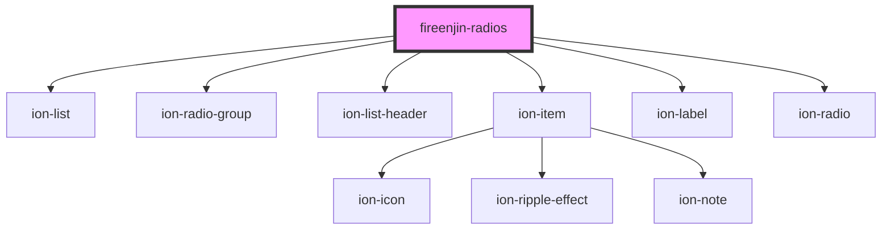

# fireenjin-radios

<!-- Auto Generated Below -->

## Properties

| Property              | Attribute               | Description | Type                                 | Default     |
| --------------------- | ----------------------- | ----------- | ------------------------------------ | ----------- |
| `allowEmptySelection` | `allow-empty-selection` |             | `boolean`                            | `false`     |
| `disabled`            | `disabled`              |             | `boolean`                            | `false`     |
| `label`               | `label`                 |             | `string`                             | `undefined` |
| `labelPosition`       | `label-position`        |             | `"fixed" \| "floating" \| "stacked"` | `undefined` |
| `lines`               | `lines`                 |             | `"full" \| "inset" \| "none"`        | `"none"`    |
| `name`                | `name`                  |             | `string`                             | `undefined` |
| `options`             | --                      |             | `FieldOption[]`                      | `undefined` |
| `required`            | `required`              |             | `any`                                | `undefined` |
| `value`               | `value`                 |             | `any`                                | `undefined` |

## Dependencies

### Depends on

- ion-list
- ion-radio-group
- ion-list-header
- ion-item
- ion-label
- ion-radio

### Graph

----------------------------------------------

*Built with [StencilJS](https://stenciljs.com/)*
