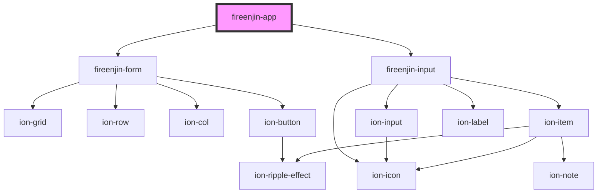

# fireenjin-renderer

<!-- Auto Generated Below -->

## Dependencies

### Depends on

- [fireenjin-form](form)
- [fireenjin-input](input)

### Graph

----------------------------------------------

*Built with [StencilJS](https://stenciljs.com/)*
