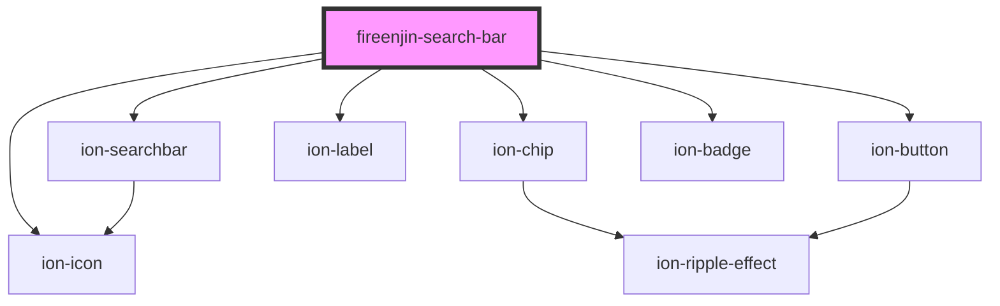

# fireenjin-search-bar

<!-- Auto Generated Below -->

## Properties

| Property           | Attribute            | Description | Type               | Default     |
| ------------------ | -------------------- | ----------- | ------------------ | ----------- |
| `beforeGetResults` | `before-get-results` |             | `any`              | `undefined` |
| `disabled`         | `disabled`           |             | `boolean`          | `false`     |
| `displayMode`      | `display-mode`       |             | `"grid" \| "list"` | `"grid"`    |
| `filters`          | --                   |             | `filterControl[]`  | `undefined` |
| `modeToggle`       | `mode-toggle`        |             | `boolean`          | `false`     |
| `paginationEl`     | `pagination-el`      |             | `any`              | `undefined` |
| `showFilter`       | `show-filter`        |             | `boolean`          | `true`      |
| `showSort`         | `show-sort`          |             | `boolean`          | `true`      |
| `sorts`            | --                   |             | `filterControl[]`  | `undefined` |

## Events

| Event              | Description | Type                                 |
| ------------------ | ----------- | ------------------------------------ |
| `fireenjinTrigger` |             | `CustomEvent<FireEnjinTriggerInput>` |

## Methods

### `clearFilter(event: any, clearingControl: filterControl) => Promise<void>`

#### Returns

Type: `Promise<void>`

### `clearSort(event: any, clearingControl: filterControl) => Promise<void>`

#### Returns

Type: `Promise<void>`

### `togglePaginationDisplay() => Promise<void>`

#### Returns

Type: `Promise<void>`

### `updateCurrentFilters() => Promise<void>`

#### Returns

Type: `Promise<void>`

### `updateCurrentSorts() => Promise<void>`

#### Returns

Type: `Promise<void>`

## Dependencies

### Depends on

- ion-searchbar
- ion-chip
- ion-icon
- ion-label
- ion-button
- ion-badge

### Graph

----------------------------------------------

*Built with [StencilJS](https://stenciljs.com/)*
