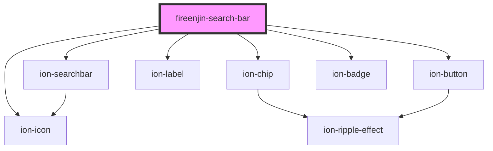

# fireenjin-search-bar

<!-- Auto Generated Below -->

## Properties

| Property           | Attribute            | Description | Type              | Default     |
| ------------------ | -------------------- | ----------- | ----------------- | ----------- |
| `beforeGetResults` | `before-get-results` |             | `any`             | `undefined` |
| `disabled`         | `disabled`           |             | `boolean`         | `false`     |
| `filters`          | --                   |             | `FilterControl[]` | `undefined` |
| `modeToggle`       | `mode-toggle`        |             | `boolean`         | `false`     |
| `paginationEl`     | `pagination-el`      |             | `any`             | `undefined` |
| `showFilter`       | `show-filter`        |             | `boolean`         | `true`      |

## Events

| Event              | Description | Type                                      |
| ------------------ | ----------- | ----------------------------------------- |
| `fireenjinTrigger` |             | `CustomEvent<FireEnjinTriggerInput<any>>` |

## Methods

### `clearFilter(event: any, clearingControl: FilterControl) => Promise<void>`

#### Parameters

| Name              | Type                                                                                                                                                                                                                                                                                                                                                                                                                                                                                                                                  | Description |
| ----------------- | ------------------------------------------------------------------------------------------------------------------------------------------------------------------------------------------------------------------------------------------------------------------------------------------------------------------------------------------------------------------------------------------------------------------------------------------------------------------------------------------------------------------------------------- | ----------- |
| `event`           | `any`                                                                                                                                                                                                                                                                                                                                                                                                                                                                                                                                 |             |
| `clearingControl` | `{ resultsKey?: string; name: string; icon?: string; label?: string; value?: any; header?: string; subHeader?: string; message?: string; optionEl?: (result: any) => any; endpoint?: string; query?: string; limit?: number; orderBy?: string; dataPropsMap?: any; params?: any; multiple?: boolean; disabled?: boolean; cancelText?: string; okText?: string; placeholder?: string; selectedText?: string; interface?: SelectInterface; interfaceOptions?: any; compareWith?: string \| SelectCompareFn; options?: FieldOption[]; }` |             |

#### Returns

Type: `Promise<void>`

## Dependencies

### Depends on

- ion-searchbar
- ion-chip
- ion-icon
- ion-label
- ion-button
- ion-badge

### Graph

----------------------------------------------

*Built with [StencilJS](https://stenciljs.com/)*
