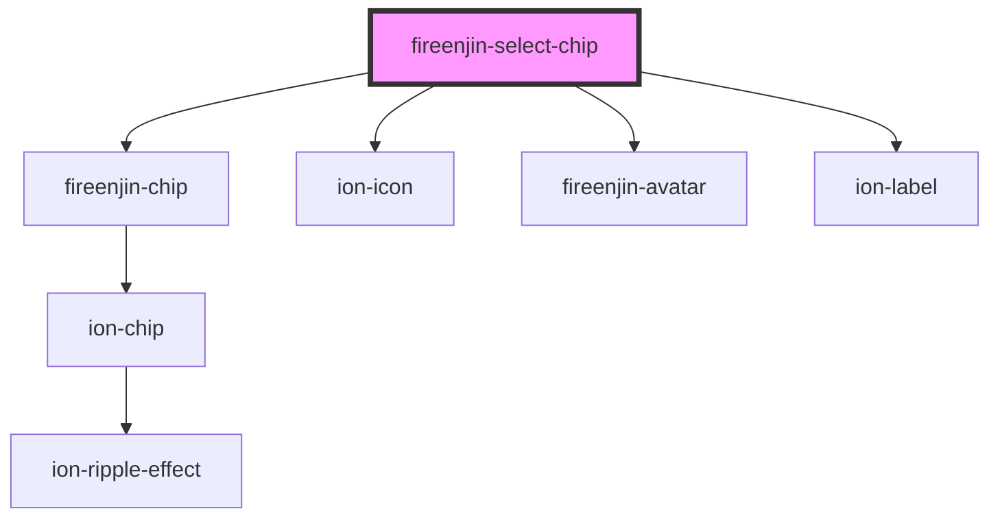

# fireenjin-select-chip

<!-- Auto Generated Below -->

## Properties

| Property                   | Attribute                    | Description | Type                                                                                                                                                                                                                                                                                                                                                                                                                  | Default                 |
| -------------------------- | ---------------------------- | ----------- | --------------------------------------------------------------------------------------------------------------------------------------------------------------------------------------------------------------------------------------------------------------------------------------------------------------------------------------------------------------------------------------------------------------------- | ----------------------- |
| `color`                    | `color`                      |             | `"danger" \| "dark" \| "light" \| "medium" \| "primary" \| "secondary" \| "success" \| "tertiary" \| "warning" \| string & Record<never, never>`                                                                                                                                                                                                                                                                      | `undefined`             |
| `disableBackgroundDismiss` | `disable-background-dismiss` |             | `boolean`                                                                                                                                                                                                                                                                                                                                                                                                             | `false`                 |
| `disableSelectedCount`     | `disable-selected-count`     |             | `boolean`                                                                                                                                                                                                                                                                                                                                                                                                             | `false`                 |
| `disabled`                 | `disabled`                   |             | `boolean`                                                                                                                                                                                                                                                                                                                                                                                                             | `false`                 |
| `icon`                     | `icon`                       |             | `string`                                                                                                                                                                                                                                                                                                                                                                                                              | `undefined`             |
| `label`                    | `label`                      |             | `string`                                                                                                                                                                                                                                                                                                                                                                                                              | `undefined`             |
| `multiple`                 | `multiple`                   |             | `boolean`                                                                                                                                                                                                                                                                                                                                                                                                             | `false`                 |
| `name`                     | `name`                       |             | `string`                                                                                                                                                                                                                                                                                                                                                                                                              | `undefined`             |
| `options`                  | --                           |             | `{ name?: string; image?: string; label?: string; color?: Color; checked?: boolean; icon?: string; value?: string; header?: string; subHeader?: string; message?: string; optionEl?: (result: any) => HTMLIonSelectOptionElement; placeholder?: string; endpoint?: string; query?: string; limit?: number; orderBy?: string; dataPropsMap?: string; params?: any; options?: { label: string; value: string; }[]; }[]` | `undefined`             |
| `outline`                  | `outline`                    |             | `boolean`                                                                                                                                                                                                                                                                                                                                                                                                             | `false`                 |
| `placeholder`              | `placeholder`                |             | `string`                                                                                                                                                                                                                                                                                                                                                                                                              | `undefined`             |
| `selectIcon`               | `select-icon`                |             | `string`                                                                                                                                                                                                                                                                                                                                                                                                              | `"chevron-down-circle"` |
| `selectedText`             | `selected-text`              |             | `string`                                                                                                                                                                                                                                                                                                                                                                                                              | `"Selected"`            |
| `showBackdrop`             | `show-backdrop`              |             | `boolean`                                                                                                                                                                                                                                                                                                                                                                                                             | `false`                 |
| `value`                    | `value`                      |             | `string`                                                                                                                                                                                                                                                                                                                                                                                                              | `undefined`             |

## Events

| Event       | Description | Type               |
| ----------- | ----------- | ------------------ |
| `ionChange` |             | `CustomEvent<any>` |
| `ionInput`  |             | `CustomEvent<any>` |

## Dependencies

### Depends on

- [fireenjin-chip](../chip)
- ion-icon
- [fireenjin-avatar](../avatar)
- ion-label

### Graph

----------------------------------------------

*Built with [StencilJS](https://stenciljs.com/)*
