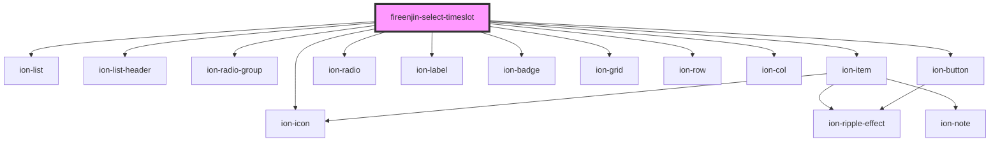

# fireenjin-select-timeslot

<!-- Auto Generated Below -->

## Properties

| Property               | Attribute                | Description                                     | Type                                                                                                                                             | Default             |
| ---------------------- | ------------------------ | ----------------------------------------------- | ------------------------------------------------------------------------------------------------------------------------------------------------ | ------------------- |
| `duration`             | `duration`               |                                                 | `number`                                                                                                                                         | `undefined`         |
| `durationLabel`        | `duration-label`         |                                                 | `string`                                                                                                                                         | `"min"`             |
| `hideControls`         | `hide-controls`          | Should the form controls be hidden?             | `boolean`                                                                                                                                        | `false`             |
| `label`                | `label`                  |                                                 | `string`                                                                                                                                         | `"Select Timeslot"` |
| `lines`                | `lines`                  |                                                 | `"full" \| "none"`                                                                                                                               | `"full"`            |
| `name`                 | `name`                   |                                                 | `string`                                                                                                                                         | `"timeslot"`        |
| `nextButton`           | `next-button`            | What the next button says                       | `string`                                                                                                                                         | `undefined`         |
| `nextButtonColor`      | `next-button-color`      | What color the next button is                   | `"danger" \| "dark" \| "light" \| "medium" \| "primary" \| "secondary" \| "success" \| "tertiary" \| "warning" \| string & Record<never, never>` | `undefined`         |
| `nextButtonExpand`     | `next-button-expand`     | What color the next button is                   | `"block" \| "full"`                                                                                                                              | `"full"`            |
| `nextButtonFill`       | `next-button-fill`       | What fill option to use for the next button     | `"clear" \| "default" \| "outline" \| "solid"`                                                                                                   | `"clear"`           |
| `nextButtonShape`      | `next-button-shape`      | What shape is the next button                   | `"round"`                                                                                                                                        | `undefined`         |
| `nextButtonSize`       | `next-button-size`       | What size is the next button                    | `"default" \| "large" \| "small"`                                                                                                                | `undefined`         |
| `previousButton`       | `previous-button`        | What the previous button says                   | `string`                                                                                                                                         | `undefined`         |
| `previousButtonColor`  | `previous-button-color`  | What color the previous button is               | `"danger" \| "dark" \| "light" \| "medium" \| "primary" \| "secondary" \| "success" \| "tertiary" \| "warning" \| string & Record<never, never>` | `undefined`         |
| `previousButtonExpand` | `previous-button-expand` | What color the previous button is               | `"block" \| "full"`                                                                                                                              | `"full"`            |
| `previousButtonFill`   | `previous-button-fill`   | What fill option to use for the previous button | `"clear" \| "default" \| "outline" \| "solid"`                                                                                                   | `"clear"`           |
| `previousButtonShape`  | `previous-button-shape`  | What shape is the previous button               | `"round"`                                                                                                                                        | `undefined`         |
| `previousButtonSize`   | `previous-button-size`   | What size is the previous button                | `"default" \| "large" \| "small"`                                                                                                                | `undefined`         |
| `value`                | `value`                  |                                                 | `string`                                                                                                                                         | `undefined`         |

## Events

| Event       | Description | Type                                            |
| ----------- | ----------- | ----------------------------------------------- |
| `ionChange` |             | `CustomEvent<{ name: string; value: string; }>` |

## Dependencies

### Depends on

- ion-list
- ion-list-header
- ion-radio-group
- ion-item
- ion-radio
- ion-label
- ion-badge
- ion-grid
- ion-row
- ion-col
- ion-button
- ion-icon

### Graph

----------------------------------------------

*Built with [StencilJS](https://stenciljs.com/)*
