# fireenjin-table

<!-- Auto Generated Below -->

## Properties

| Property            | Attribute             | Description | Type                                                                                                                                                                                                         | Default                                                            |
| ------------------- | --------------------- | ----------- | ------------------------------------------------------------------------------------------------------------------------------------------------------------------------------------------------------------ | ------------------------------------------------------------------ |
| `columns`           | --                    |             | `{ label?: string; name?: string; key?: string; placeholder?: string; disabled?: boolean; type?: "string" \| "number" \| "boolean" \| "select" \| "file" \| "photo" \| "phone" \| "tel"; options?: any; }[]` | `undefined`                                                        |
| `deleteButtonAttrs` | `delete-button-attrs` |             | `any`                                                                                                                                                                                                        | `{     fill: "clear",     color: "danger",     size: "small",   }` |
| `deleteEndpoint`    | `delete-endpoint`     |             | `string`                                                                                                                                                                                                     | `undefined`                                                        |
| `edit`              | `edit`                |             | `boolean`                                                                                                                                                                                                    | `false`                                                            |
| `editEndpoint`      | `edit-endpoint`       |             | `string`                                                                                                                                                                                                     | `undefined`                                                        |
| `endpoint`          | `endpoint`            |             | `string`                                                                                                                                                                                                     | `undefined`                                                        |
| `fetch`             | `fetch`               |             | `boolean \| string`                                                                                                                                                                                          | `undefined`                                                        |
| `fetchParams`       | `fetch-params`        |             | `any`                                                                                                                                                                                                        | `undefined`                                                        |
| `loading`           | `loading`             |             | `boolean`                                                                                                                                                                                                    | `false`                                                            |
| `resultsKey`        | `results-key`         |             | `string`                                                                                                                                                                                                     | `undefined`                                                        |
| `rowId`             | `row-id`              |             | `string`                                                                                                                                                                                                     | `"id"`                                                             |
| `rows`              | --                    |             | `any[]`                                                                                                                                                                                                      | `undefined`                                                        |
| `showDelete`        | `show-delete`         |             | `boolean`                                                                                                                                                                                                    | `false`                                                            |

## Events

| Event             | Description | Type                                |
| ----------------- | ----------- | ----------------------------------- |
| `fireenjinFetch`  |             | `CustomEvent<FireEnjinFetchEvent>`  |
| `fireenjinSubmit` |             | `CustomEvent<FireEnjinSubmitEvent>` |

## Methods

### `fetchData({ endpoint, params, }?: { endpoint?: string; params?: any; }) => Promise<void>`

#### Returns

Type: `Promise<void>`

## Dependencies

### Depends on

- ion-text
- [fireenjin-select](../select)
- [fireenjin-toggle](../toggle)
- [fireenjin-input-photo](../input-photo)
- [fireenjin-input-file](../input-file)
- [fireenjin-input](../input)
- ion-button
- ion-icon

### Graph

```mermaid
graph TD;
  fireenjin-table --> ion-text
  fireenjin-table --> fireenjin-select
  fireenjin-table --> fireenjin-toggle
  fireenjin-table --> fireenjin-input-photo
  fireenjin-table --> fireenjin-input-file
  fireenjin-table --> fireenjin-input
  fireenjin-table --> ion-button
  fireenjin-table --> ion-icon
  fireenjin-select --> ion-label
  fireenjin-select --> ion-item
  fireenjin-select --> ion-popover
  fireenjin-select --> ion-content
  fireenjin-select --> ion-list
  fireenjin-select --> ion-item-divider
  fireenjin-select --> ion-select
  fireenjin-select --> ion-select-option
  fireenjin-select --> ion-icon
  ion-item --> ion-icon
  ion-item --> ion-ripple-effect
  ion-item --> ion-note
  ion-popover --> ion-backdrop
  ion-select --> ion-select-popover
  ion-select --> ion-popover
  ion-select --> ion-action-sheet
  ion-select --> ion-alert
  ion-select-popover --> ion-item
  ion-select-popover --> ion-checkbox
  ion-select-popover --> ion-label
  ion-select-popover --> ion-radio-group
  ion-select-popover --> ion-radio
  ion-select-popover --> ion-list
  ion-select-popover --> ion-list-header
  ion-action-sheet --> ion-backdrop
  ion-action-sheet --> ion-icon
  ion-action-sheet --> ion-ripple-effect
  ion-alert --> ion-ripple-effect
  ion-alert --> ion-backdrop
  fireenjin-toggle --> ion-item
  fireenjin-toggle --> ion-label
  fireenjin-toggle --> ion-toggle
  ion-toggle --> ion-icon
  fireenjin-input-photo --> ion-button
  fireenjin-input-photo --> ion-icon
  ion-button --> ion-ripple-effect
  fireenjin-input-file --> ion-card
  fireenjin-input-file --> ion-item
  fireenjin-input-file --> ion-icon
  ion-card --> ion-ripple-effect
  fireenjin-input --> ion-input
  fireenjin-input --> ion-item
  fireenjin-input --> ion-icon
  fireenjin-input --> ion-label
  ion-input --> ion-icon
  style fireenjin-table fill:#f9f,stroke:#333,stroke-width:4px
```

----------------------------------------------

*Built with [StencilJS](https://stenciljs.com/)*
