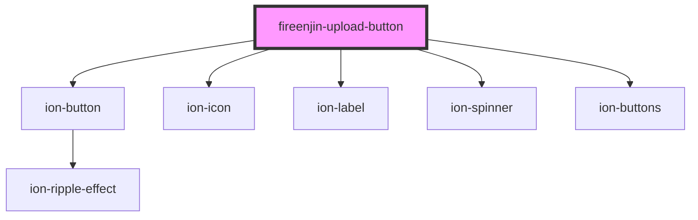

# fireenjin-upload-button

<!-- Auto Generated Below -->

## Properties

| Property      | Attribute     | Description | Type                                                                                                                                             | Default          |
| ------------- | ------------- | ----------- | ------------------------------------------------------------------------------------------------------------------------------------------------ | ---------------- |
| `accept`      | `accept`      |             | `string`                                                                                                                                         | `undefined`      |
| `color`       | `color`       |             | `"danger" \| "dark" \| "light" \| "medium" \| "primary" \| "secondary" \| "success" \| "tertiary" \| "warning" \| string & Record<never, never>` | `"primary"`      |
| `disabled`    | `disabled`    |             | `boolean`                                                                                                                                        | `false`          |
| `endpoint`    | `endpoint`    |             | `string`                                                                                                                                         | `"upload"`       |
| `expand`      | `expand`      |             | `string`                                                                                                                                         | `"block"`        |
| `fileName`    | `file-name`   |             | `string`                                                                                                                                         | `undefined`      |
| `fill`        | `fill`        |             | `string`                                                                                                                                         | `"outline"`      |
| `iconEnd`     | `icon-end`    |             | `string`                                                                                                                                         | `"cloud-upload"` |
| `iconStart`   | `icon-start`  |             | `string`                                                                                                                                         | `undefined`      |
| `label`       | `label`       |             | `string`                                                                                                                                         | `undefined`      |
| `multiple`    | `multiple`    |             | `boolean`                                                                                                                                        | `false`          |
| `name`        | `name`        |             | `string`                                                                                                                                         | `"file"`         |
| `path`        | `path`        |             | `string`                                                                                                                                         | `undefined`      |
| `placeholder` | `placeholder` |             | `string`                                                                                                                                         | `undefined`      |
| `required`    | `required`    |             | `boolean`                                                                                                                                        | `false`          |
| `shape`       | `shape`       |             | `"round"`                                                                                                                                        | `"round"`        |
| `showClear`   | `show-clear`  |             | `boolean`                                                                                                                                        | `false`          |
| `showLink`    | `show-link`   |             | `boolean`                                                                                                                                        | `false`          |
| `value`       | `value`       |             | `any`                                                                                                                                            | `undefined`      |

## Events

| Event             | Description | Type                                |
| ----------------- | ----------- | ----------------------------------- |
| `fireenjinUpload` |             | `CustomEvent<FireEnjinUploadEvent>` |
| `ionChange`       |             | `CustomEvent<any>`                  |

## Methods

### `clear() => Promise<void>`

#### Returns

Type: `Promise<void>`

## Dependencies

### Depends on

- ion-button
- ion-icon
- ion-label
- ion-spinner
- ion-buttons

### Graph

----------------------------------------------

*Built with [StencilJS](https://stenciljs.com/)*
